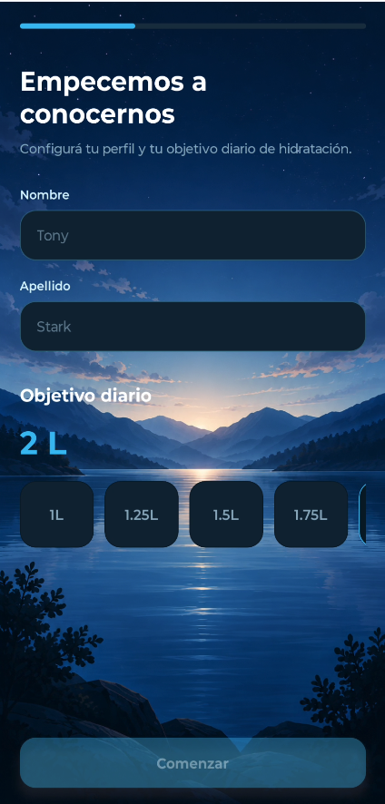
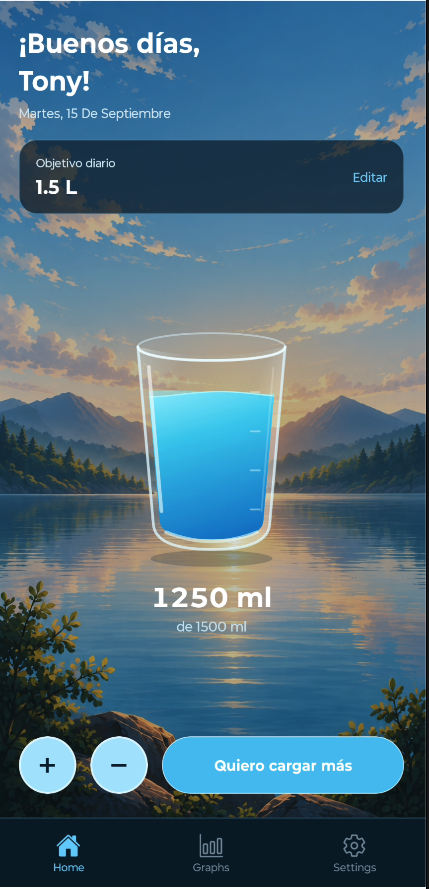
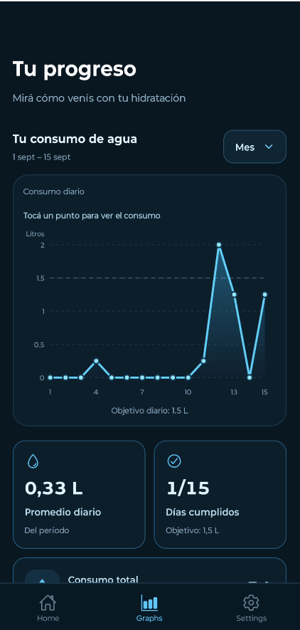
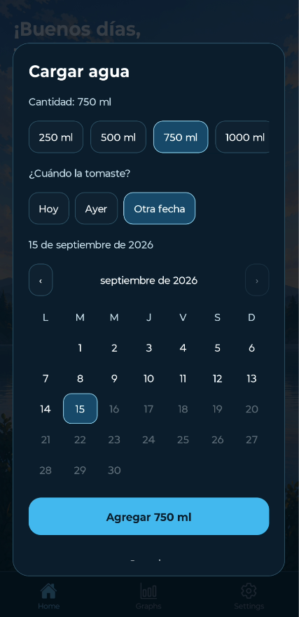
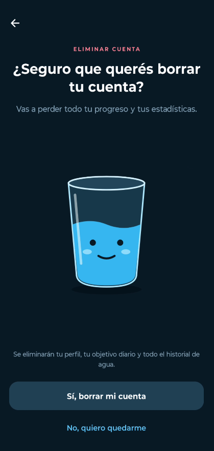
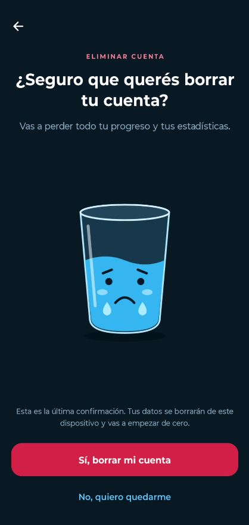

# WaterTracker 💧

A mobile app that makes daily hydration easy to track. Set a personal water goal, log each glass, and watch your progress come to life with an animated water glass and interactive charts.

Built with **Expo, React Native, and TypeScript** for Android and iOS. The current app interface is in Spanish.

## Features

- **Personal onboarding:** enter your name and choose a daily hydration goal.
- **Daily tracking:** add or subtract 250 ml with a tap, or select a larger amount.
- **Backdated entries:** log water for today, yesterday, or a past date using the calendar.
- **Animated water glass:** see the water level respond to your intake, with backgrounds that change by time of day.
- **Progress insights:** explore weekly, monthly, and yearly charts, daily averages, goal completion, and total consumption.
- **Premium preview:** a mock popup with proposed benefits and an example price. No purchases or subscriptions are processed.
- **Local account reset:** a two-step confirmation with a crying water glass removes your profile, goal, and hydration history, then returns you to onboarding.

## Screenshots

### Make it yours



### Track your hydration

| Home | Progress | Add water |
| --- | --- | --- |
|  |  |  |

### Account deletion

| First confirmation | Final confirmation |
| --- | --- |
|  |  |

## Tech stack

| Technology | Purpose |
| --- | --- |
| Expo SDK 57 | App tooling and runtime |
| React Native 0.86 · React 19.2 | Mobile interface |
| TypeScript | Type checking |
| React Navigation | Stack and bottom-tab navigation |
| AsyncStorage | Persistent local profile and hydration data |
| React Native SVG | Water glass illustrations and charts |
| Lottie | Splash screen animation |
| Expo Vector Icons | Interface icons |

## Getting started

### Prerequisites

- Node.js 22.13 or newer and npm.
- An Expo Go version compatible with SDK 57 on a physical device, or an Android emulator / iOS Simulator.
- The iOS Simulator requires macOS and Xcode; Android emulation requires Android Studio and an emulator setup.

### Install and run

```bash
npm install
npx expo start --go
```

Scan the QR code to open the project in Expo Go. For a physical device, keep your phone and computer on the same Wi-Fi network.

From the Expo terminal:

- Press **a** to open Android.
- Press **i** to open the iOS Simulator.
- Press **r** to reload an app that is already open and connected.

You can also use `npm start`, `npm run android`, or `npm run ios`.

See the [Expo SDK 57 documentation](https://docs.expo.dev/versions/v57.0.0/) for SDK requirements and the [Expo CLI guide](https://docs.expo.dev/more/expo-cli/) for launch options.

## Data storage

Profile details, the daily goal, onboarding completion, and water entries are stored locally with AsyncStorage. Water intake is recorded by calendar date, and statistics are calculated from that history. The app has no backend authentication or cloud sync.

Deleting the local account removes the stored profile and hydration records, resets navigation, and starts onboarding again.

## Project structure

```text
src/
  components/   Buttons, inputs, popups, charts, and progress UI
  constants/    Shared colors
  hooks/        Progress loading and refresh logic
  navigation/   Root stack and bottom tabs
  screens/      Onboarding, home, progress, settings, and deletion
  services/     Local water storage and statistics calculations
  views/        Animated water glass illustrations
assets/         Background images, icons, and Lottie animation
public/         Screenshots used in this README
tests/         Storage and progress tests
```

## Validation

```bash
npx tsc --noEmit
node --test tests/progress.cjs
```

The tests cover progress calculations, legacy data migration, concurrent intake updates, and account deletion after pending writes.

## License

[MIT](LICENSE).
